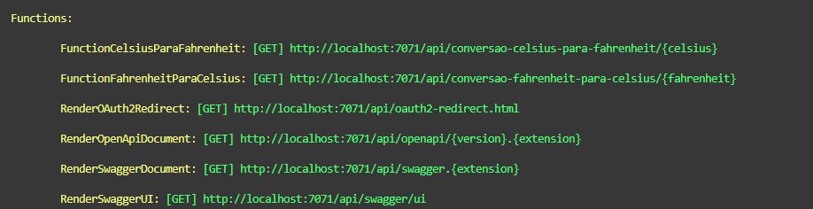
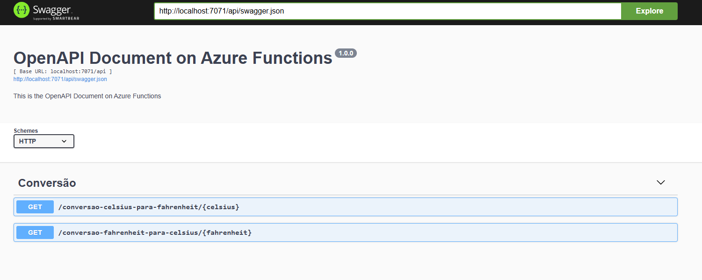

# 🌡️ Conversão de Temperatura com Azure Functions

Este projeto foi desenvolvido no curso da DIO: "Introdução a Deploy e Azure Functions" e demonstra como criar uma Azure Function do tipo **HTTP Trigger** com nível de segurança **Anonymous**, utilizando o modelo **in-process** e suporte à documentação via **OpenAPI/Swagger**.

---

## 📦 Requisitos

- [.NET 8 SDK](https://dotnet.microsoft.com/)
- [Azure Functions Core Tools](https://learn.microsoft.com/azure/azure-functions/functions-run-local)
- [Node.js + npm](https://nodejs.org/) (para Azurite)

---

## 🚀 Para utilizar a aplicação, siga os passos recomendados abaixo

### 1. Clone o projeto

```bash
git clone https://github.com/erasmobezerra/AzureFunctionsConversaoTemperatura.git
cd ./AzureFunctionsConversaoTemperatura
```

---

### 2. Restaure os pacotes

```bash
dotnet restore
```

### 3. Configurar `local.settings.json`

```json
{
  "IsEncrypted": false,
  "Values": {
    "AzureWebJobsStorage": "UseDevelopmentStorage=true",
    "FUNCTIONS_WORKER_RUNTIME": "dotnet-isolated"
  }
}
```

### 4. Instalar Azurite

Para evitar custos com recursos do Azure, você pode simular uma conta de armazenamento local com o **Azurite**:

```bash
npm install -g azurite
```

### 5. Executar Azurite

```bash
azurite
```

No terminal será exibido os endpoints das functions:



---

## 6. Construe e Execute o Projeto

Pressione **F5** no Visual Studio ou execute:

```bash
dotnet build
func start
```

---

### 7. Acessar  a documentação com Swagger UI

Abra o navegador e acesse:

```
http://localhost:7071/api/swagger/ui
```

Você verá uma interface gerada automaticamente com base nas definições OpenAPI da função. Nela você poderá relaizar os testes das functions de conversão de temperatura!



---

## 🚀 Passo a passo para o Deploy da sua Azure Function

1. Acesse sua conta na Azure e clique no serviço "Aplicativo de Funções".

2. Clique em Criar. Selecione a opção de hospedagem "Consumo".

3. Na próxima página informe ou crie um Grupo de Recursos e crie um nome para o Aplicativo de Funções

4. Em Sistema Operacional informe "Windows"; Em Pilha de runtime informe ".NET"; Verão informe "Versão 8 (LTS)" e Região "Brazil South". Depois clique em Revisar + Criar

5. Para o Deploy, utilizei a extensão do Visual Studio Code para subir a minha aplicação para o Aplicativo de Função recém criado na Azure.

6. Finalizado o deploy, Acesse o painel principal do seu Aplicativo de Função criado na azure e clique no Domínio Padrão para ser abrir o endereço no neu navegador padrão.

7. Acrescente ao endereço gerado: /api/swagger/ui para ter acesso a documentação Swagger.


## 🤝 Como contribuir

1. Crie uma branch com nome descritivo: `feature/minha-mudanca`.  
2. Faça commits pequenos e claros.  
3. Abra Pull Request descrevendo o que foi alterado e por quê.  

---

🙏 Agradeço profundamente à **Digital Innovation One** por proporcionar este aprendizado gratuito e de qualidade. Um reconhecimento especial ao professor **[Leonardo Buta](https://www.linkedin.com/in/leonardo-buta/)** pela excelente didática e orientação durante todo o processo.

<div align="center">
  <p>⭐ Se este projeto foi útil para você, considere dar uma estrela!</p>
</div>
